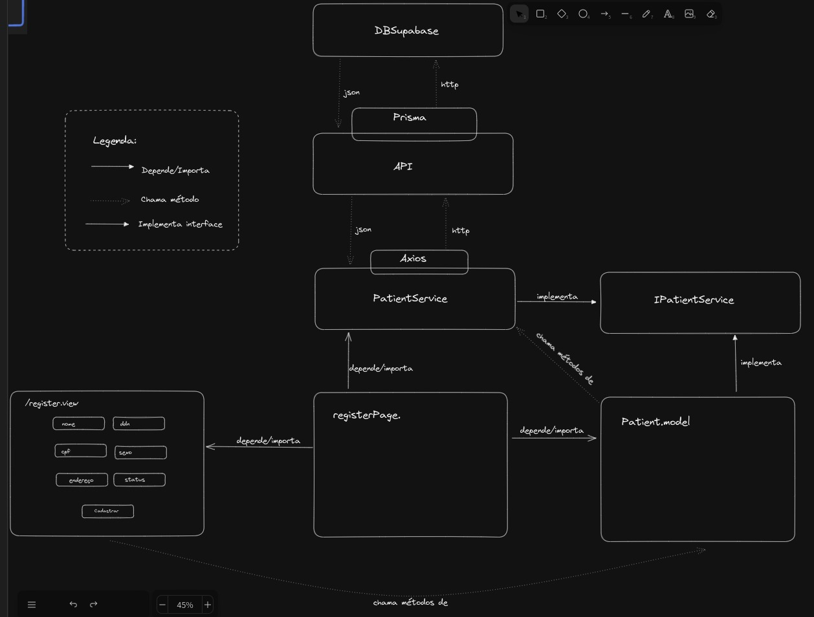

# Acme Healthcare

Projeto de exercício técnico.

### Techstack
 Para concluir os requisitos, foram utilizadas as seguinte tecnologias:
 - Framework: NextJS
 - UI: ShadCN; Tailwind
 - Persistência: Supabase; PrismaORM

### Arquitetura e organização

O projeto aplica o padrão de arquitetura MVVM. 
Na camada da view foi utilizado ShadCN e conjunt com Tailwind para definir o visual e é identificada pelos arquivos `*.view.tsx`.

A camada de Model é responsável pela validação dos formulários e regras de negócio (não pode cadastrar o mesmo cpf, por exemplo) e são os arquivos `*.model.ts`. A Model também é a camada do dados que serão apresentados na View, de forma que a View é uma função da Model.

A camada ModelView é reponsável pela comunicação com serviços, comunicação entre as camadas e implementação de interfaces.

O projeto usa React Context para compartilhar funcionalidades e permitir que haja apenas uma instância de model.

A seguir uma imagem exempleficando as relações entre as camadas:

### Rodando o projeto localmente

Para executar o projeto, clone ele na sua máquina.
Depois, criei um arquivo `.env` na raiz do projeto e adicione as chaves enviadas por e-mail.
